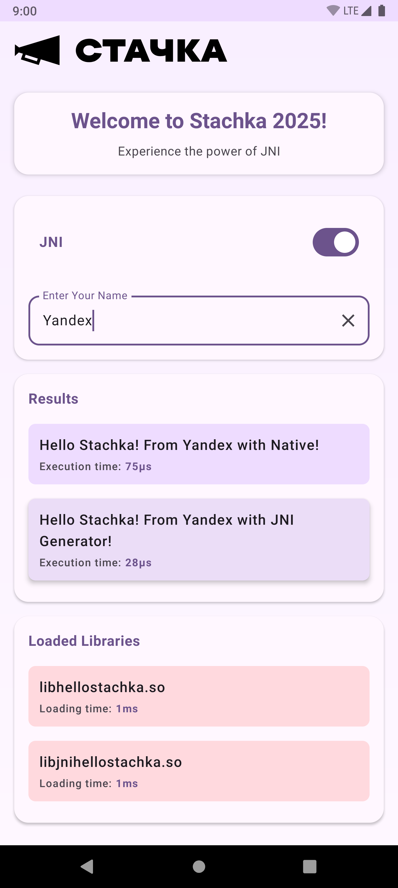

# JNI Demo

A demonstration Android application showcasing different approaches to Java Native Interface (JNI) implementation and native code integration in Android applications.

## Project Overview

This project demonstrates various ways to integrate native code with Android applications using JNI. It includes examples of:

- Standard JNI implementation
- JNI with a custom generator
- Integration with external build systems (Bazel)
- Different native build approaches (CMake, ndk-build, Bazel)

The app displays a simple UI where users can enter their name and see greetings generated by both Java and native code, with performance metrics for comparison.

## Project Structure

### Main Application

- **simple-jni**: Main Android application module that demonstrates JNI functionality with a Jetpack Compose UI

### Native Code Modules

- **jnihellostachka**: JNI implementation using a custom JNI generator
- **hellostachka-lib**: Native library built with Bazel, demonstrating external build system integration

### JNI Generation

- **jnigenerator**: Custom JNI generator tools
  - **python**: Python scripts for JNI code generation
  - **cpp**: C++ essential headers and implementations for JNI
  - **java/annotations**: Java annotations for JNI generation

### Support Modules

- **libloader**: Utility module for loading native libraries with performance tracking
- **logging**: Simple logging utilities
- **theme**: UI theme components
- **icons**: Application icons

### Build System

- **buildSrc**: Custom Gradle build logic including JNI build configuration
- **external-build-plugin**: Gradle plugin for integrating with external build systems (Bazel)

## Build Configuration

The project supports three different native build approaches, configurable via the `jniBuild` property in `local.properties`:

### CMake Build (Default)

```properties
jniBuild=cmake
```

Uses CMake to build the native code. This is the most modern approach for native builds in Android.

### NDK Build

```properties
jniBuild=ndkBuild
```

Uses the older ndk-build system with Android.mk files.

### External Build (Bazel)

```properties
jniBuild=externalBuild
```

Uses Bazel as an external build system. The native code is defined in the `hellostachka-lib` directory.

**Known Issue**: Currently, libraries built with Bazel only work on Android SDK 28.

## JNI Implementation Details

The project demonstrates two different approaches to JNI:

1. **Standard JNI** (`HelloStachka.kt`):
   - Traditional JNI approach with manually created header files
   - Native implementation in `hellostachka-lib/cpp/hello_stachka.cpp`

2. **JNI Generator** (`JniHelloStachka.java`):
   - Uses custom annotations and JNI generator
   - Simplifies JNI development by automating header generation
   - Native implementation in `jnihellostachka/src/main/cpp/jni_hello_stachka.cpp`

Both implementations provide a `sayHello` method that returns a greeting string from native code.

## Native Library Loading

The project uses a custom `LibLoader` utility that:

- Loads native libraries
- Measures and records loading time
- Provides an observer pattern to notify components when libraries are loaded

## UI Implementation

The UI is built with Jetpack Compose and features:

- Material 3 design components
- Animated transitions
- Performance measurement for both Java and native method calls
- Display of loaded native libraries with loading times

## Building and Running

1. Clone the repository
2. Configure your preferred JNI build system in `local.properties`:
   ```properties
   jniBuild=cmake  # or ndkBuild or externalBuild
   ```
3. For External ensure [Bazel](https://bazel.build) is installed on your system
4. Build and run the project using Android Studio or Gradle:

   ```
   ./gradlew :simple-jni:assembleDebug
   ```

## Screenshots



## References

- [Android External Native Builds](https://developer.android.com/studio/projects/gradle-external-native-builds)
- [Android NDK Samples](https://github.com/android/ndk-samples)
- [Bazel Build System](https://bazel.build/)
